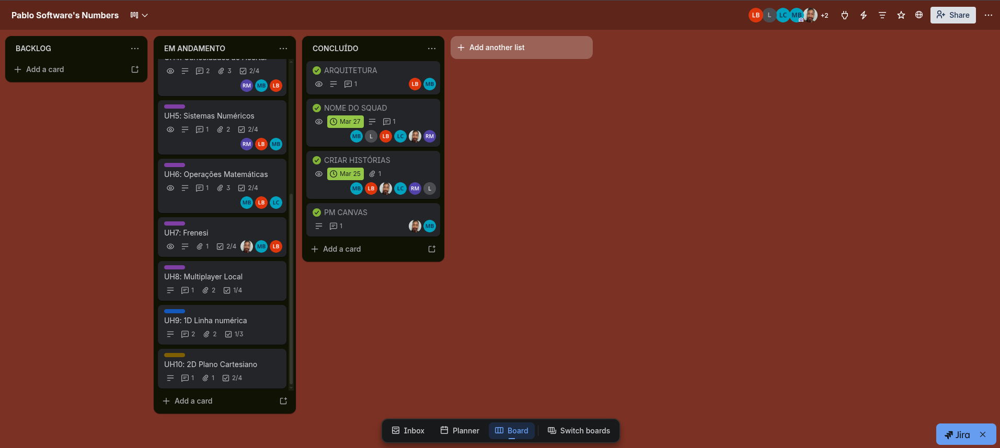

# Adivinhe O Número

Um jogo de adivinhar números (de 0 a 100) desenvolvido em C.

## O que o programa DEVE fazer?
- O programa deve randomizar um valor dentro de um intervalo definido.
- O programa deve receber inputs (tentativas) do jogador através da interface.
- O programa deve fornecer feedback claro se a tentativa foi acima ou abaixo do número secreto.
- O programa deve oferecer uma interface visual amigável e funcional.

## Backlog do Projeto ([Trello](https://trello.com/b/R0YXpUzE/organizacao-projeto-2))


## Histórias de Usuário

### **UH0: Jogabilidade no Terminal**

* **Descrição:** Como jogador, quero poder rodar o jogo diretamente no terminal.
* **Conversa:** O programa deve detectar se deve iniciar o modo gráfico ou oferecer uma versão simplificada de entrada e saída de texto.
* **Critérios:** O fluxo principal (sorteio, palpite e feedback) deve funcionar via comandos de texto.
  
### **UH1: Seleção de Dificuldade**

* **Descrição:** Como jogador, quero escolher o nível de dificuldade (10, 100, 1000, 10000) para ajustar o desafio ao meu gosto.
* **Conversa:** O menu inicial deve permitir selecionar a intensidade antes da partida.
* **Critérios:** Variação clara de intervalos e pontuação proporcional à dificuldade.

### **UH2: Modo Trilha de Dificuldades**

* **Descrição:** Como jogador, quero um modo de progressão linear para perceber minha evolução técnica.
* **Conversa:** Sistema de fases onde a complexidade aumenta gradualmente.
* **Critérios:** Desbloqueio de novos níveis e exibição de progresso/lista de fases.

### **UH3: Feedback de Proximidade**

* **Descrição:** Como jogador, quero saber se estou perto do número para ajustar minha estratégia.
* **Conversa:** O sistema dará dicas como "Quente" ou "Frio" baseadas na distância do palpite.
* **Critérios:** Mensagens visuais/sonoras dinâmicas que variam conforme a proximidade.

### **UH4: Modo de Acessibilidade**

* **Descrição:** Como jogador com deficiência visual, quero jogar de forma autônoma.
* **Conversa:** Implementação de feedbacks sonoros e suporte a leitores de tela.
* **Critérios:** Avisos sonoros para ações importantes (ex: se o chute foi maior ou menor).

### **UH5: Limite de Tentativas**

* **Descrição:** Como jogador, quero um número limitado de chances para aumentar o desafio.
* **Conversa:** Adição de uma condição de "Game Over" ao esgotar as tentativas.
* **Critérios:** Contador de "Vidas" visível e interrupção do jogo ao chegar a zero.

### **UH6: Persistência de Recorde (High Score)**

* **Descrição:** Como jogador, quero que meu melhor resultado seja salvo localmente.
* **Conversa:** O sistema compara o resultado atual com o recorde salvo e atualiza se for maior.
* **Critérios:** Recorde mantido após fechar o jogo e mensagem de "Novo Recorde!".

### **UH7: Mensagens de Resultado**

* **Descrição:** Como jogador, quero mensagens claras e imersivas sobre o fim do jogo.
* **Conversa:** Textos específicos para vitória ou derrota por tentativas/tempo.
* **Critérios:** Exibição de "Parabéns!" no acerto e incentivos em caso de perda.

### **UH8: Histórico de Palpites**

* **Descrição:** Como jogador, quero ver meus últimos 5 palpites para não repetir números.
* **Conversa:** Exibição de uma coluna lateral com o histórico recente de chutes.
* **Critérios:** Área específica na janela com atualização instantânea após cada tentativa.

### **UH9: Reinício Rápido (Play Again)**

* **Descrição:** Como jogador, quero reiniciar a partida rapidamente sem fechar o programa.
* **Conversa:** Tecla de atalho (Ex: 'R') para resetar o jogo instantaneamente.
* **Critérios:** Limpeza do histórico e geração de novo número sem encerrar o processo.

### **UH10: Identificação de Palpite Repetido**

* **Descrição:** Como jogador, quero ser avisado se repetir um palpite para não desperdiçar chances.
* **Conversa:** O sistema valida o chute contra o array de palpites anteriores.
* **Critérios:** Alerta de "Número já tentado" sem descontar vidas do jogador.

## Como rodar no projeto?

Primeiro, clone este repositório para sua máquina:
```bash
git clone https://github.com/miglitopictures/AdivinheONumero
```

Agora, identifique seu sistema operacional e siga as instruções abaixo para compilar o código.

<details>
  <summary><b>Compilando no Linux</b></summary>
  
1. Dê permissão de execução para o script:
   ```bash
   chmod +x build_linux.sh
   ```
2. Execute o script de build para compilar o programa:
   ```bash
   ./build_linux.sh
   ```
3. Rode o executável:
   ```bash
   ./game
   ```
</details>

<details>
  <summary><b>Compilando no Windows</b></summary>
  
Se você estiver usando o **MinGW/GCC** no Windows:
1. Abra o PowerShell ou CMD na pasta do projeto.
2. Execute o script de build para compilar o programa:
   ```cmd
   .\build_windows.bat
   ```
3. Rode o executável:
   ```bash
   ./game.exe
   ```
*Nota: Certifique-se de que o caminho do seu compilador (bin) esteja nas Variáveis de Ambiente (PATH).*
</details>

<details>
  <summary><b>Compilando no Mac</b></summary>
  
O processo é similar ao Linux, utilizando o terminal:
1. Garanta a permissão:
   ```bash
   chmod +x build_mac.sh
   ```
2. Execute o script de build para compilar o programa:
   ```bash
   ./build_mac.sh
   ```
3. Rode o executável:
   ```bash
   ./game
   ```
</details>

## Como trabalhar no projeto?
Para isso, preparamos algumas intruções que podem ser localizadas no arquivo [INSTRUCOES.md](INSTRUCOES.md)!
*Qualquer dúvida, contatar miglito.

## Equipe
- [Lucas Bonfim](https://github.com/l-bonfim) (Frontend)
- [Lucas Carvalho](https://github.com/J4keless) (Backend)
- [Lucas Valença](https://github.com/LucasGuilhermeValenca) (Frontend)
- [Miguel Duarte](https://github.com/miglitopictures) (Frontend)
- [Pablo Tamborini](https://github.com/PTN81) (Backend)
- [Rodrigo Montenegro](https://github.com/rodrigomscmontenegro) (Backend)

## Sobre
Esse é o projeto unificador do segundo período do curso de ADS do **CESAR School**. Desenvolvido para aplicar conceitos de lógica de programação, estruturas de dados e interfaces gráficas em C.
