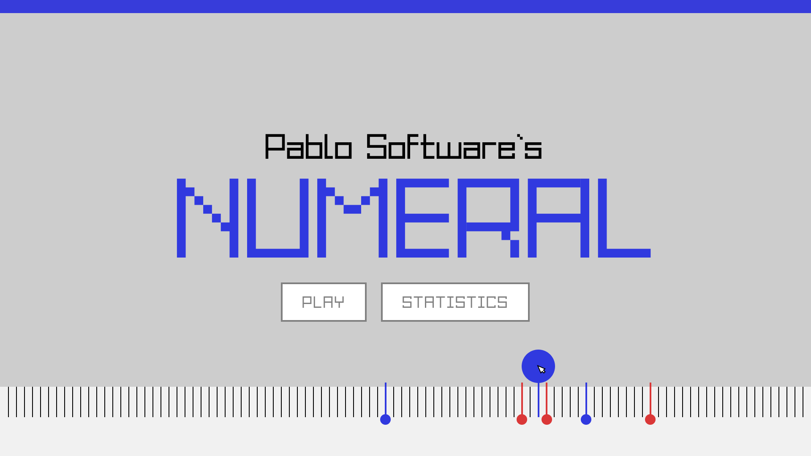
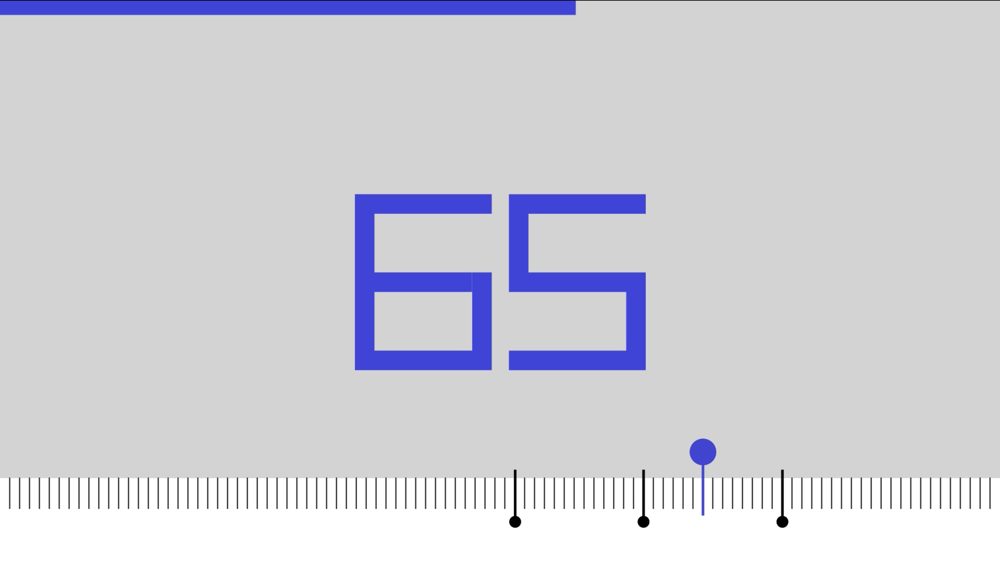
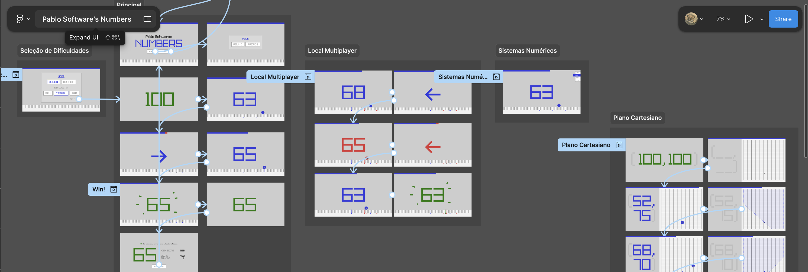

# Pablo Software's **Numeral**
Um jogo casual de adivinhar números em uma linha numérica, perfeito para momentos de procrastinação. Desafie seus sentidos em um action-game minimalista, batalhe no multiplayer local e alcance o highscore no modo arcade.



---

## Honrar a Premissa
Deparados com a proposta **"jogo de advinhar números de 0 a 100"**, estabelecida para o projeto integrador nesse período, quebramos bastante a cabeça pensando quais caminhos poderíamos seguir em um limitador tão claro e preciso. **Como fazer algo interessante a partir disso?** Cogitamos desenvolver algo mais "fora-da-caixa" que reinterpretasse, expandisse ou até distorcesse um pouco a proposta inicial e supomos que outras equipes devem ter passado pelo mesmo dilema. Eventualmente chegamos em um direcionamento para o projeto, mudando um pouco a nossa pergunta inicial, de "Como fazer algo interessante a partir disso?", para **"Como fazer isso ser interessante?"**, decidimos honrar 100% a premissa e abandonar qualquer ideia que tirasse o foco dela. Tomamos como nosso desafio utilizar os princípos de Interfaces Humano Computador, Programação, Engenharia de Software e Gestão de Projetos que aprendemos ao longo do período para tornar um jogo com uma premissa tão simples em algo interessante e divertido.

---

## Interface Numérica
O elemento central do jogo é a **linha numérica** — uma espécie de régua interativa controlada pelo mouse. Ela serve a três funções ao mesmo tempo:
 
- **Alvo principal** — onde o jogador clica para dar seu palpite
- **Histórico visual** — palpites anteriores ficam marcados na régua
- **Feedback de proximidade** — o jogador enxerga seu progresso e se aproxima da resposta
A partir dessa interação central, desenvolvemos toda a interface. Você pode ver uma demonstração animada abaixo:

[](https://www.youtube.com/watch?v=L74IL4UUWyY)


Além da simulação animada, desenvolvemos um protótipo navegável de alta fidelidade no Figma para nossa interface, implementando o restante do nosso fluxo e jogo e funcionalidades adicionais:

[](https://www.figma.com/proto/UmOYtPDtwu6C4vAOKjSVRf/Pablo-Software-s-Numbers?node-id=107-60&starting-point-node-id=107%3A60&t=1Hx9YyfoWuX6dcAD-1)

Após o desenvolvimento do jogo, desenvolvemos um [relatório](docs/HEURUSTICAS.md) analizando o comprimento de Numeral as heuristicas de Nielsen.

---

## Arquitetura
Para que o desenvolvimento do projeto podesse fluir com mais facilidade, utilizamos uma arquitetura em trës camadas (Interface, Lógica, Dados) e nos dividimos como equipe a partir delas. A ideia é que, idealmente, as camas sejam independentes e conversem apenas por funções preestabelecidas.

| Camada | Responsabilidade |
|--------|-----------------|
| **Interface** | Renderização e captura de inputs do jogador |
| **Lógica** | Game loop, cálculo de scores e estatísticas |
| **Dados** | Leitura, armazenamento e exibição de dados |

---

## Histórias de Usuário
Concebemos 11 histórias de usuário (funcionalidades), detalhadas em [HISTORIAS.md](docs/HISTORIAS.md). A partir delas, organizamos nosso projeto e backlog.

---

## Especificações técnicas
O jogo pode ser facilmente compilado para Linux (Debian, Ubuntu), MacOS (Silicon) e Windows. Utilizamos a linguagem de programação C (standard C11) e a biblioteca Raylib (interface), para o desenvolvimento. Na camada de lógica, a maioria das funções manipula com ponteiros a estrutura Session *game, que armazena os dados atuais e historico da partida. Na camada de interface, consumimos os dados de Session *game para atualizar a vizualização do jogo. Funções recursivas foram utilizadas para o calculo de soma e desvio padrão (somaRec() e desvioRec()), na tela de análise de estatísticas.

---

## Como rodar no projeto?

Primeiro, clone este repositório para sua máquina:
```bash
git clone https://github.com/miglitopictures/AdivinheONumero
```

Agora, identifique seu sistema operacional e siga as instruções abaixo para compilar o código.

<details>
  <summary><b>Compilando no Linux</b></summary>
  
1. Dê permissão de execução para o script:
   ```bash
   chmod +x build_linux.sh
   ```
2. Execute o script de build para compilar o programa:
   ```bash
   ./build_linux.sh
   ```
3. Rode o executável:
   ```bash
   ./game
   ```
</details>

<details>
  <summary><b>Compilando no Windows</b></summary>
  
Se você estiver usando o **MinGW/GCC** no Windows:
1. Abra o PowerShell ou CMD na pasta do projeto.
2. Execute o script de build para compilar o programa:
   ```cmd
   .\build_windows.bat
   ```
3. Rode o executável:
   ```bash
   .\game.exe
   ```
*Nota: Certifique-se de que o caminho do seu compilador (bin) esteja nas Variáveis de Ambiente (PATH).*
</details>

<details>
  <summary><b>Compilando no Mac</b></summary>
  
O processo é similar ao Linux, utilizando o terminal:
1. Garanta a permissão:
   ```bash
   chmod +x build_mac.sh
   ```
2. Execute o script de build para compilar o programa:
   ```bash
   ./build_mac.sh
   ```
3. Rode o executável:
   ```bash
   ./game
   ```
</details>

---

## Como trabalhar no projeto?
Para isso, preparamos algumas intruções que podem ser localizadas em **[INSTRUCOES.md](docs/INSTRUCOES.md)**.

---

### O que cada arquivo faz?
Se tiver duvidas sobre a organização do projeto ou sobre a funcionalidade de arquivos, consulte **[ARQUIVOS.md](docs/ARQUIVOS.md)**.

*Qualquer dúvida, contatar miglito ou lucas bonfim.

---
 
## Equipe
 
| Nome | Área |
|------|------|
| [Lucas Bonfim](https://github.com/l-bonfim) | Interface · Lógica (estatísticas, curiosidades) |
| [Lucas Carvalho](https://github.com/J4keless) | Lógica (cálculo de scores) |
| [Lucas Valença](https://github.com/LucasGuilhermeValenca) | Dados (leitura e armazenamento) |
| [Miguel Duarte](https://github.com/miglitopictures) | Interface · Lógica (game loop, RNG) · Gerenciamento |
| [Pablo Tamborini](https://github.com/PTN81) | Lógica (cálculo de scores) |
| [Raysa Queiroz](https://github.com/raysacq) | Dados (leitura e exibição de curiosidades) |
| [Rodrigo Montenegro](https://github.com/rodrigomscmontenegro) | Dados (leitura e armazenamento) |
 
---

## Sobre
Esse é o projeto unificador do segundo período do curso de ADS do **CESAR School**. Desenvolvido para aplicar conceitos de lógica de programação, estruturas de dados e interfaces gráficas em C, utilizando [Raylib](https://raylib.com).
